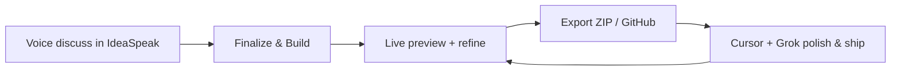

# IdeaSpeak → Grok → Cursor — World-Class Refinement Workflow

This is the recommended loop for going from a spoken idea to a production app, then refining it with Grok and Cursor without losing taste or context.

## The loop (5 steps)



### 1. Discuss & scope (voice-first)

Open [ideaspeak-app.vercel.app](https://ideaspeak-app.vercel.app) → **Begin voice conversation**.

- Grok helps you land on a **buildable v1** (one core loop, one wow moment).
- Expect short, practical replies — not feature dumps.
- When scope feels right, say *"let's build it"* or tap **Finalize Plan & Build**.

### 2. Build with Grok

- **Discuss** uses `grok-4.3` (fast, `reasoning_effort: none` in voice).
- **Build** uses `grok-build-0.1` (agentic coding).
- Live Sandpack preview updates as you refine.

### 3. Refine in IdeaSpeak

- Voice or text refinements in Build mode.
- Use personalities (witty, mentor, coach, rebel) for different feedback styles.
- Queue prompts on mobile when offline.

### 4. Export with full context

**Export ZIP** or **Push to GitHub** — every export includes:

| File | Purpose |
|------|---------|
| `AGENTS.md` | Rules for any AI continuing the project |
| `IDEA-SPEAK-CONTEXT.md` | Vision, brief, provenance |
| `.cursorrules` | Cursor auto-loads these rules |
| `.cursor/rules/ideaspeak.md` | Cursor rules mirror |
| `.github/` | CI + shipping notes |

These files are the bridge between IdeaSpeak and downstream tools.

### 5. Refine in Cursor + Grok

**Open exported project in Cursor**

Cursor picks up `.cursorrules` and `AGENTS.md` automatically.

**In Grok (CLI or IDE)**

```bash
cd your-exported-app
grok
```

Recommended commands:

```text
/check-work          # Verify build, tests, diff quality
/implement <task>     # Implementer + reviewer loop until clean
/review              # Pre-PR review
```

Load IdeaSpeak prompts for faithful continuation:

```text
Follow prompts/IdeaSpeak-xAI-Agent-System-Prompt.md and IDEA-SPEAK-CONTEXT.md strictly.
```

Or use the bundled skill:

```text
Load ~/.grok/skills/ideaspeak/SKILL.md
```

**Ship with MCP (preferred over PAT export)**

- `grok_com_github` — create repo, push, open PR
- `grok_com_vercel` — deploy, env vars, aliases

## Smoke test (before demo or release)

```bash
# Production API + UI
bun run smoke

# Include slow build endpoint (~2 min)
bun run smoke:full

# Local dev (requires bun run dev:full)
bun run smoke:local
```

## Troubleshooting

| Symptom | Fix |
|---------|-----|
| `SIMULATOR` badge | Add `XAI_API_KEY` in Vercel → Production, redeploy |
| Status says not live | Key empty or invalid — re-add at [console.x.ai](https://console.x.ai) |
| Voice sounds robotic | Hard refresh; voice uses short replies + TTS sanitization |
| Build returns error | Check Vercel logs; build uses `grok-build-0.1` |

## Quality bar checklist

Before calling v1 done:

- [ ] Core loop works on mobile width
- [ ] Empty / loading / error states exist
- [ ] Design tokens in CSS (no random inline colors)
- [ ] `bun run smoke` passes on production
- [ ] Grok `/check-work` finds 0 issues on export
- [ ] README has run + env instructions

## Why this beats Lovable-only

- **Voice-native scoping** before codegen (fewer wrong apps)
- **Engineered prompts** in `/prompts/` (taste + production rules)
- **Export context** for Cursor/Grok (no amnesia on handoff)
- **Verification loop** (`/check-work`, `/implement`, `/review`)

Speak the idea. Ship the slice. Refine with Grok and Cursor until it’s undeniable.